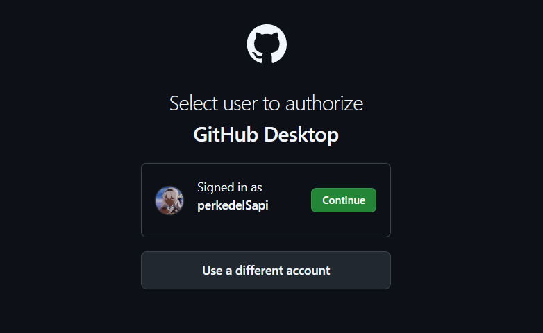
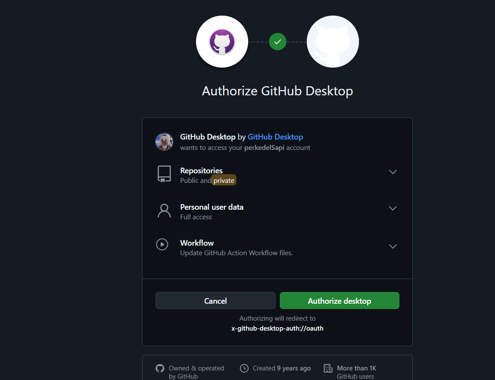
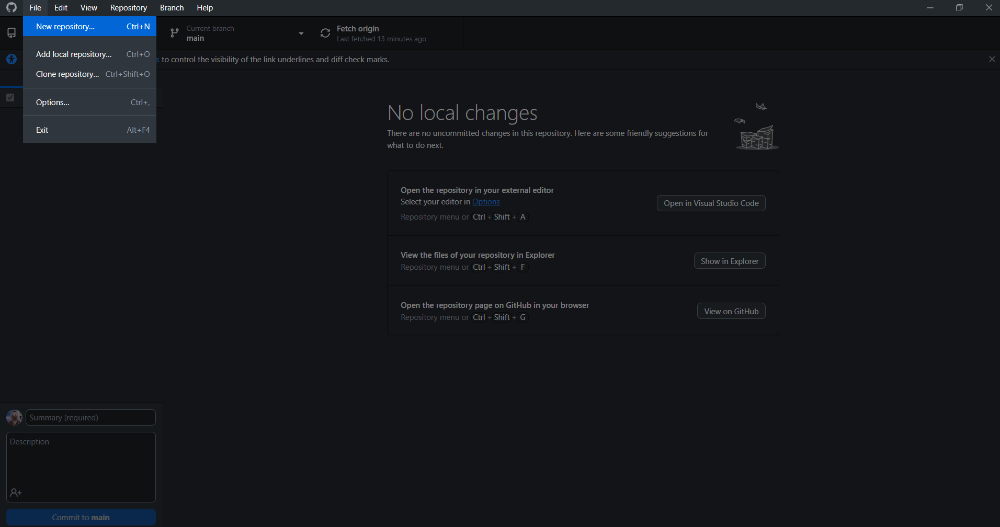
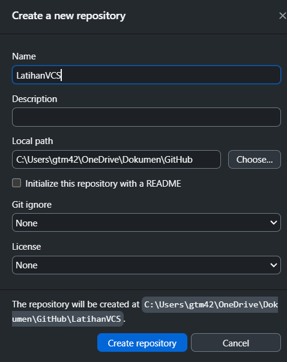
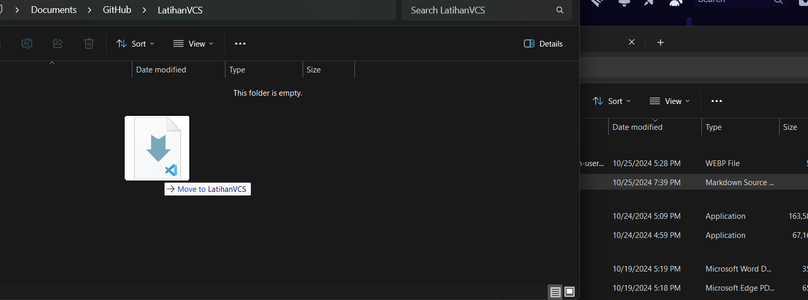
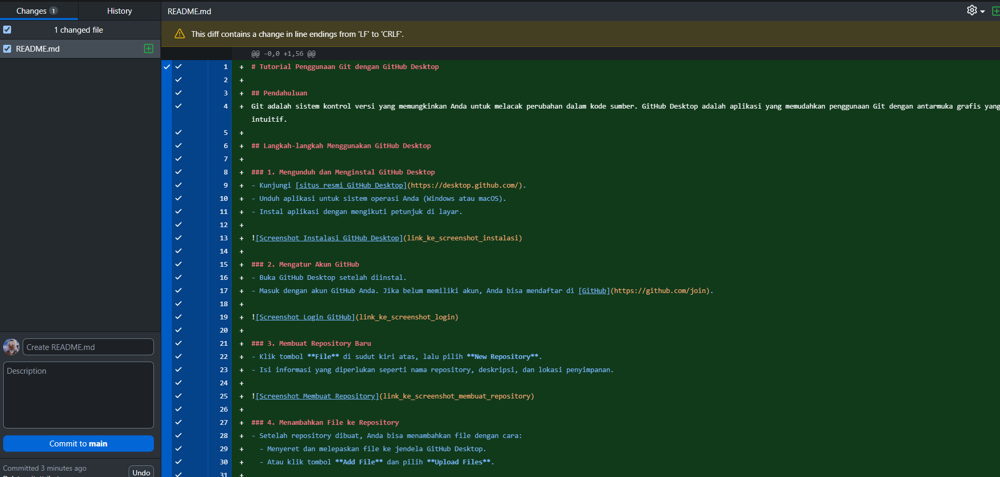
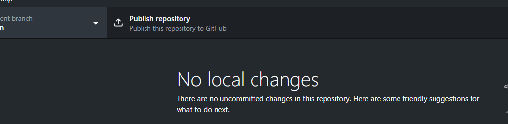
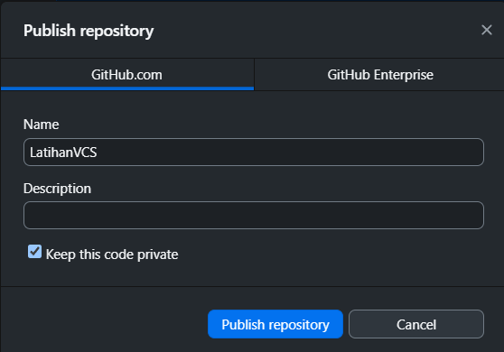
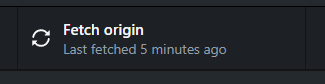

# Tutorial Penggunaan Git dengan GitHub Desktop

## Pendahuluan
Git adalah sistem kontrol versi yang memungkinkan Anda untuk melacak perubahan dalam kode sumber. GitHub Desktop adalah aplikasi yang memudahkan penggunaan Git dengan antarmuka grafis yang intuitif.

## Langkah-langkah Menggunakan GitHub Desktop

### 1. Mengunduh dan Menginstal GitHub Desktop
- Kunjungi [situs resmi GitHub Desktop](https://desktop.github.com/).
- Unduh aplikasi untuk sistem operasi Anda (Windows atau macOS).
- Instal aplikasi dengan mengikuti petunjuk di layar.

  

### 2. Mengatur Akun GitHub
- Buka GitHub Desktop setelah diinstal.
- Masuk dengan akun GitHub Anda. Jika belum memiliki akun, Anda bisa mendaftar di [GitHub](https://github.com/join).

### 3. Membuat Repository Baru
- Klik tombol **File** di sudut kiri atas, lalu pilih **New Repository**.
- Isi informasi yang diperlukan seperti nama repository, deskripsi, dan lokasi penyimpanan.

### 4. Menambahkan File ke Repository
- Setelah repository dibuat, Anda bisa menambahkan file dengan cara:
  - Menyeret dan melepaskan file ke jendela GitHub Desktop.
  - Atau klik tombol **Add File** dan pilih **Upload Files**.

### 5. Melakukan Commit
- Setelah menambahkan file, berikan pesan commit yang menjelaskan perubahan yang Anda lakukan.
- Klik tombol **Commit to main** untuk menyimpan perubahan.

### 6. Menghubungkan ke Remote Repository
- Jika Anda ingin menghubungkan repository lokal ke repository di GitHub, klik tombol **Publish repository**.
- Pilih apakah repository Anda akan bersifat publik atau pribadi, lalu klik **Publish Repository**.

### 7. Mengirim Perubahan
- Untuk menarik perubahan terbaru dari remote, klik tombol **Fetch origin**.
- Untuk mengirim perubahan lokal ke remote, klik tombol **Push origin**.

## Kesimpulan
Dengan GitHub Desktop, Anda dapat dengan mudah mengelola proyek Anda menggunakan Git. Ikuti langkah-langkah di atas untuk mulai menggunakan Git dengan antarmuka yang ramah pengguna.

Untuk informasi lebih lanjut, Anda dapat mengunjungi [dokumentasi GitHub Desktop](https://docs.github.com/en/desktop).

